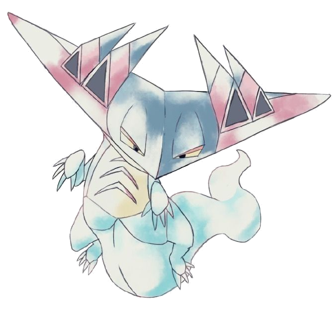

## Dragapultist – Pokémon TCG Analyzer 

Dragapultist is an experimental tool for analyzing Pokémon TCG Live game exports.  
Paste in a full game log and get a structured, replay-style view of turns, prizes, and key decisions so you can review games instead of scrolling through raw text.

---

## 🧭 Architecture Diagrams

You can view the C4-style architecture diagrams in this folder:

- [docs/architecture](docs/architecture/README.md)

---

## ✨ Features

- Paste Pokémon TCG Live export text and parse it into structured turns
- See a timeline of actions (attachments, attacks, abilities, retreat, etc.)
- Track prize cards, knockouts, and damage over time
- Filter by player to focus on one side of the game
- Step forward and backward through turns to review decision points
- Simple, responsive UI built with React / Next.js / TypeScript

---

## 🧱 Tech Stack

- **Framework:** Next.js (React)
- **Language:** TypeScript
- **Styling:** Tailwind CSS
- **State / Data:** Local React state + parsing utilities
- **Deployment:** Vercel (serverless-friendly)

This is currently a client-focused project that parses text in the browser.

---

## 📎 Using the App

1. Open **Pokémon TCG Live** and finish a game.
2. Copy the **game log / export text** (the same text you’d normally paste into a document).
3. Open **Dragapultist**.
4. Paste the export text into the input area.
5. Let the app parse and structure the game.
6. Use the UI to step through turns, decisions, and key moments.

As the project grows, the goal is to:

- Save these games in a common, shareable format.
- Allow search / filter by deck, matchup, or turn pattern.
- Make it easy to review your own games or other players’ games just by loading an export.

---

## 🚀 Getting Started (Local Development)

### Prerequisites

- Node.js (v18+ recommended)
- pnpm 10 (the repository's pinned package manager)

### Clone and install

    git clone <YOUR_REPO_URL_HERE>
    cd dragapultist
    corepack pnpm install

### Run the dev server

    corepack pnpm dev

Then open:

- http://localhost:3000

---

## 🧪 Project Status

Dragapultist is a **work in progress**:

- The parser currently focuses on common log patterns from Pokémon TCG Live.
- Some edge cases and unusual logs may not be parsed perfectly yet.
- The UI and data model are evolving as more real game logs are tested.

If something breaks, it’s probably a good sign the parser needs to learn a new pattern.

---

## 🗺️ Roadmap / Future Ideas

Some of the future directions for Dragapultist:

- ⚙️ **Automatic export ingestion**  
  Pull game logs directly from Pokémon TCG Live (or a companion tool) so players don’t have to remember to copy & paste.

- 📂 **Game history & search**  
  Save parsed games in a local or cloud-backed database so you can:
  - Filter by deck archetype and matchup
  - Search by opponent, date, or tournament
  - Tag games as “practice”, “ladder”, or “tournament”

- 📊 **Deeper analytics**  
  Build out:
  - Prize-map visualizations
  - Tempo / board-state snapshots per turn
  - “Pivotal turn” detection (big swings in prizes or board position)

- 🎴 **Deck-aware insights**  
  Connect games to decklists so the analyzer can:
  - Track which cards were never seen
  - Highlight resource management (Energry, Rare Candy, Iono / Judge, etc.)
  - Compare game outcomes across a specific matchup (e.g., Gardevoir ex vs Gholdengo ex)

- 🌐 **Shareable replays**  
  Make it easy to share:
  - A link that loads a parsed game with all actions
  - “Layers” of annotation (coach notes, personal notes, etc.)

---

## 🧩 Development Notes

- This is a personal / fan project built for learning, analysis, and fun.
- The app is not affiliated with, endorsed, or sponsored by:
  - The Pokémon Company
  - Nintendo
  - Creatures Inc.
  - Game Freak  
- Pokémon and all respective names are trademarks of their respective owners.

If you’re using this project as a reference for your own tools:

- Feel free to reuse ideas, but please make sure your own project respects Pokémon’s IP and any applicable Terms of Service.

---

## 🛠️ Scripts (Summary)

From the project root, you can typically run:

- **Start dev server**

      corepack pnpm dev

- **Production build**

      corepack pnpm build

- **Start production server (after build)**

      corepack pnpm start

(If your package.json uses different scripts, update this section accordingly.)

---

## 🙌 Contributing / Feedback

Right now this project is primarily maintained as a personal tool and portfolio piece, but:

- Bug reports about broken logs or parsing issues are welcome.
- Suggestions for useful analytics or visualizations are also helpful.
- If you fork the project and build cool features, feel free to share them!

---

## 📜 License

This project is released under the **MIT License** (or your preferred license).  
If you haven’t added a `LICENSE` file yet, you can use the standard MIT template.

---
