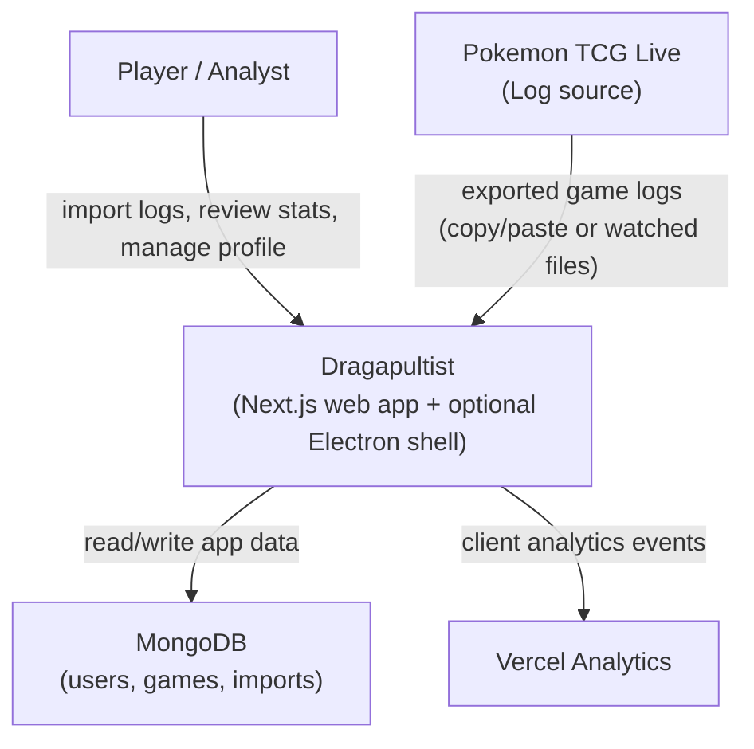

# Context Diagram (C4-style)

## Legend

- **System node**: A top-level actor or service in the environment.
- **Arrow**: Primary data or interaction flow.
- **Line label**: Purpose of the interaction.
