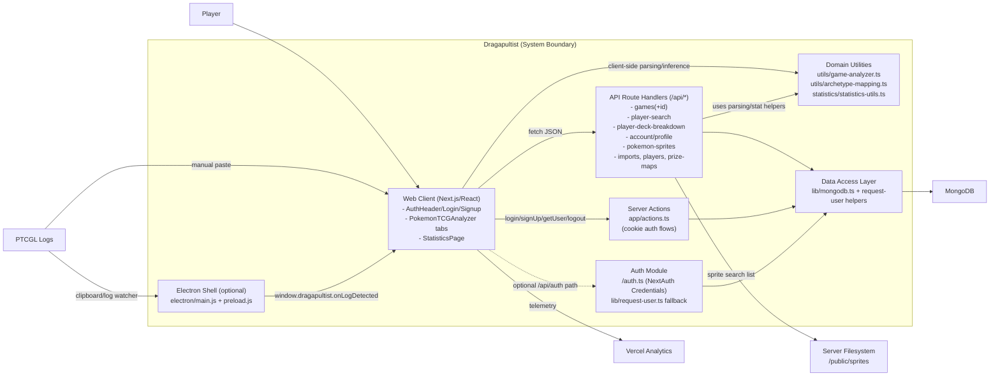

# Container Diagram (C4-style)

## Legend

- **System Boundary**: Internal Dragapultist containers.
- **Container node**: A deployable/runtime module.
- **Solid arrow**: Primary runtime flow.
- **Dashed arrow**: Optional/fallback integration path.
